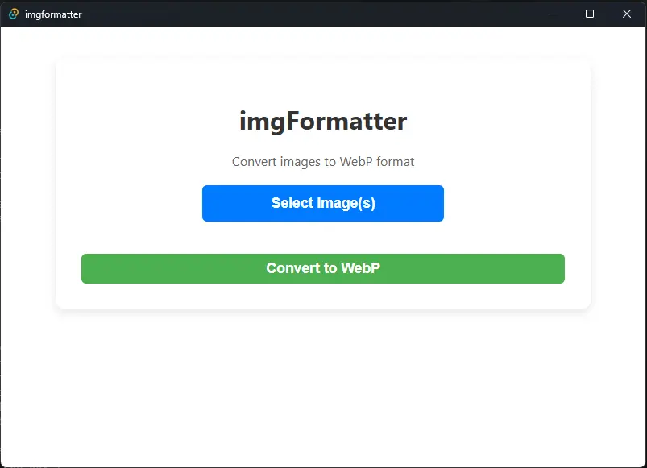
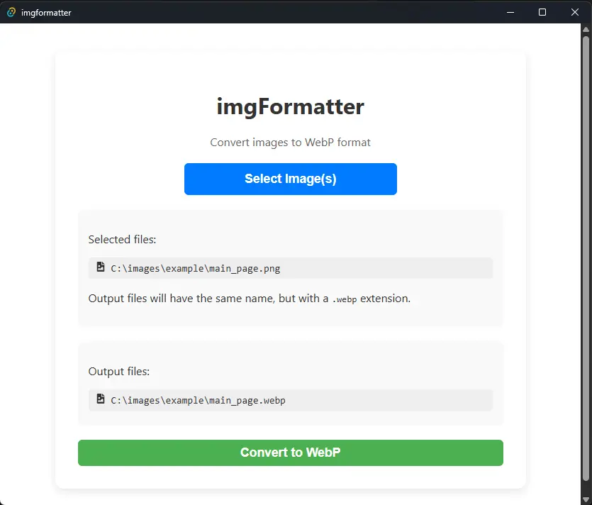

<div align='center'>

# imgFormatter

  

</div>

## Description

This project consists in an app built with Rust + Tauri + React/Typescript, that provides
a graphical user interface to manipulate [cwebp](https://developers.google.com/speed/webp/docs/cwebp) operations. 

The idea is to make it even easier to convert an image format to .webp, with the already extraordinary tool that is the **cwebp**.

Planned features include letting the user change the dimensions, quality, and other available options of **cwebp**, and applying those settings to multiple images at once.

---

> ### Status
> ⚠️ This project is in active development. The UI is minimal and functionality is evolving.  
Contributions and feedback are welcome!

---

### Usage

- Select one or more images (locally)
- The app generates corresponding `.webp` output paths automatically.
- Click "Convert to WebP" to convert all selected images.
- Conversion progress is shown in the app's console/log output.

---

### Prerequisites

- **Rust**: [https://www.rust-lang.org/tools/install](https://www.rust-lang.org/tools/install)

- **Node + npm**: [https://nodejs.org/](https://nodejs.org/)

- **Tauri**: Platform-specific dependencies, see at [https://tauri.app/start/prerequisites/](https://tauri.app/start/prerequisites/)

- **cwebp binary**: bundled with the app as a Tauri sidecar. If you prefer, you can manually download **libwebp** at [https://developers.google.com/speed/webp/download](https://developers.google.com/speed/webp/download), extract the **cwebp** binary, moving it to `./src-tauri/bin` and rename it to match what Tauri expects for your platform (e.g. cwebp.exe-x86_64-pc-windows-msvc on Windows).

---

### Running

```
# Go to the project root
cd imgFormatter

# Install dependencies (npm)
npm install

# Run in dev mode
npm run tauri dev

# OR build the executable (will be in src-tauri/target/release/bundle/)
npm run tauri build
```

---

### Screenshots

#### Main page

<div align='center'>


 


</div>

---

### Notes

The **cwebp** executable bundled in this project is part of the **libwebp**
 library, developed by the **WebM Project**.

**cwebp** is licensed under the **BSD 3-Clause License**. The full license text is included in the [cwebp-LICENSE](./src-tauri/bin/cwebp-LICENSE) file bundled alongside the executable.

###  License

This project is licensed under MIT License. See [LICENSE](./LICENSE) for more information.
